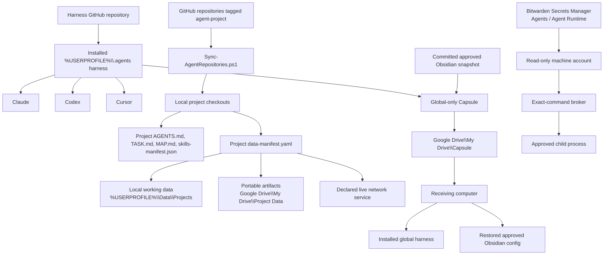

# Portable harness system map

## Authority map

| Concern | Authority | Portable route |
|---|---|---|
| Shared agent behavior | Harness GitHub repository | Global Capsule and installed `%USERPROFILE%\.agents` |
| Project code and committed state | Each project's GitHub repository | Clone once; fetch and fast-forward eligible updates |
| Project inventory | GitHub topic `agent-project` | `Sync-AgentRepositories.ps1` |
| Local external data | `%USERPROFILE%\Data\Projects\<project>` | Adapter declared in `data-manifest.yaml` |
| Immutable snapshots and exports | Google Drive `My Drive\Project Data\<project>` | Checksummed project adapter |
| Live multi-device state | Project-declared network service | API, migrations, export, and restore policy |
| Runtime secrets | Bitwarden Secrets Manager | Machine account plus exact-command broker |
| Approved Obsidian settings | Tracked digest snapshot in the harness revision | Capsule `payload\obsidian\config` |
| File Explorer pins | Existing project paths | `Repair-QuickAccess.ps1` after project clone |

## What Capsule contains

- `payload\harness\.agents`;
- approved Obsidian settings, snippets, theme files, and plugin IDs;
- bootstrap, refresh, and verification tools;
- value-safe account and software manifests;
- SHA-256 integrity records;
- canonical Git remote, exact revision, release identifier, and `.agents` tree hash checked against a separate trusted checkout.

Capsule excludes project checkouts, handoffs, repository bundles, project databases, workspace snapshots, secrets, vault notes, workspace state, plugin data, and caches.

## Update routes after installation

| Change on computer A | Route to computer B |
|---|---|
| Committed project change | Push to GitHub; fetch and integrate on B |
| Shared-harness change | Push the harness repository; refresh Capsule or pull and project the harness on B |
| Immutable project artifact | Run its manifest adapter; let Google Drive sync; verify on B |
| Live application record | Use the declared network service |
| Secret rotation | Update Bitwarden Secrets Manager; the broker retrieves the current value on its next invocation |
| Approved Obsidian setting | Deliberately capture, review, commit, refresh Capsule, verify, and restore on B |

## Receiving sequence

1. Locate `My Drive\Capsule`.
2. Copy it to local staging outside every sync root.
3. Clone or update the known `ai-consulting-1/doug-harness` repository.
4. Run that checkout's `Verify-Capsule.ps1` against Capsule and require an exact reconstructed `.agents` match.
5. Run `Harness.ps1 -Action install`.
6. Complete account-owner sign-ins.
7. Store this computer's Bitwarden Secrets Manager token through `Set-BwsMachineToken.ps1`.
8. Discover and clone GitHub repositories carrying the `agent-project` topic.
9. Run project verifiers and reviewed data adapters.
10. Repair Quick Access after repository paths exist.

## Standard paths

| Path | Purpose |
|---|---|
| `%USERPROFILE%\.agents` | Installed global harness |
| `%USERPROFILE%\projects\<repo>` | GitHub project checkout |
| `%USERPROFILE%\Data\Projects\<project>` | Local working data |
| `<My Drive>\Project Data\<project>` | Reviewed portable artifacts |
| `<My Drive>\Capsule` | Cross-computer global Capsule |

Stale environment values containing `OneDrive` or `OneDrive - <organization>` are retired by the receiving setup.

## Phone and browser access

| Need | Link type |
|---|---|
| Project file, task state, map, or handoff | GitHub web link |
| Capsule or external artifact | Google Drive share link |
| Current live app state | Deployed authenticated application URL |

Windows filesystem paths remain useful for local agents and editors.

## Obsidian safety

`Capture-ApprovedObsidianConfig.ps1` resolves the active vault from `%APPDATA%\obsidian\obsidian.json`. Capture and restore use strict allowlists, reject reparse points, and prevalidate the complete manifest. Refresh reads only the committed snapshot reconstructed from Git. Restore backs up overwritten receiving configuration.

Agents must never access `AI Reference\`, `26_Sensitive\`, `40_Reference\AI Reference.md`, `31_Business\Other People Reference.md`, or `G:\My Drive\Actual Documents\Identity`.

See `DATA-SYNC-AND-RETENTION.md` for external-data routes and `SECRETS-BITWARDEN.md` for machine-account setup.
