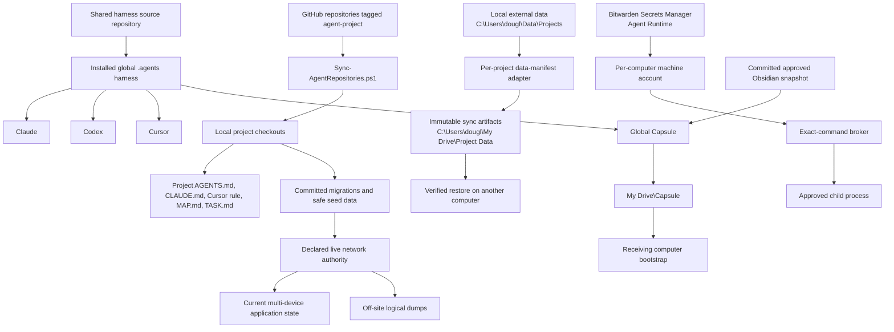

# Cross-Agent Harness

Last updated: 2026-07-29

This is the single human-facing guide for the shared Claude, Codex, and Cursor harness. It explains what travels through GitHub, what travels through Google Drive, when Supabase belongs in a project, how agents receive secrets, and how another computer reconstructs the setup. The adjacent `README.html` mirrors this guide for browser and Obsidian viewing.

**System contract:** [`SPEC.md`](../../SPEC.md) defines the technology-neutral functional requirements, acceptance criteria, and recon traceability. This guide remains the one human entrypoint and explains that contract in operating terms.

**Current release:** Windows 10/11 receiving-computer reconstruction with Claude, Codex, and Cursor parity. macOS and Linux adapters and acceptance runs are deferred to a later release.

## Selected reversible defaults

Canonical v3 selects these operating defaults:

1. **Docket:** hardened Vercel Blob with conditional writes, schema validation, complete export, and restore proof.
2. **Commit-linked large data:** DVC with a Google Drive remote.
3. **Human and immutable files:** plain Google Drive folders with ordinary Drive sharing.
4. **Retention:** the newest verified point plus the union of the 3 most recent daily buckets, 4 weekly buckets, and 3 monthly buckets per project. This can retain at most 10 points when every bucket selects a different snapshot. A project may override the three counts in its manifest.

These choices are reversible. The alternatives below remain available for a future project migration after their own acceptance evidence is complete.

## The short answer

The portable system has four authorities:

1. **GitHub repositories** carry source code, committed project files, project contracts, migrations, safe fixtures, and handoffs.
2. **Google Drive** carries the global Capsule and immutable project-data artifacts such as consistent SQLite snapshots and exports.
3. **A declared network data service** carries live shared application state. Docket currently uses Vercel Blob; relational projects may use a Vercel-connected provider database or Supabase.
4. **Bitwarden Secrets Manager** supplies runtime secrets to approved processes through machine accounts.

Docket's deployed phone and browser clients already use private Vercel Blob documents through its API. The current single-user baseline therefore favors hardening Blob with conditional writes, schema validation, complete exports, and restore drills. A provider database becomes the stronger candidate when record growth, relational queries, authentication, or concurrent writers justify the migration.

## Current human action

One credential-authority action remains: bootstrap Bitwarden Secrets Manager. In the Bitwarden web app, open the `Agents` organization, enable Secrets Manager, create one project named `Agent Runtime`, create `docket.REVIEW_SECRET`, and create one read-only machine account for each computer. When an agent runs `C:\Users\dougl\.agents\tools\Set-BwsMachineToken.ps1`, paste that computer's machine-account access token into the secure prompt. The agent then records the non-secret project and secret IDs in `C:\Users\dougl\.agents\tools\bws-command-allowlist.json` and verifies the exact Docket broker tuple.

Everything else in the receiving workflow is agent-operated. Agents install, discover, clone, pull, verify, restore approved configuration, and run project adapters.

## Full system map

### What each transport carries

| Transport | Carries | Excludes |
|---|---|---|
| GitHub | Source, project rules, migrations, safe fixtures, documentation, handoffs | Runtime databases, generated caches, machine credentials |
| Google Drive Project Data | Checksummed SQLite snapshots, exports, immutable inputs, selected media or generated artifacts | A SQLite database while an app is actively writing it |
| Network data service | Current multi-device records and concurrent app state; optionally relational rows, Auth, APIs, and objects | The only recoverable copy or the repository's schemas and migrations |
| Bitwarden Secrets Manager | Runtime secret values and machine-account authorization | Source files, databases, project artifacts |
| Capsule | Shared global harness, bootstrap and verification tools, approved Obsidian configuration | Project checkouts, project databases, workspace snapshots |

## Git-first project synchronization

Every active project has its own GitHub repository. Committing and pushing on one computer publishes that repository state. The other computer clones the repository once and pulls later commits.

The GitHub topic `agent-project` is the dynamic inventory. `C:\Users\dougl\.agents\tools\Sync-AgentRepositories.ps1` asks GitHub for the current non-archived repositories carrying that topic, so adding a project requires a repository and the topic. A hand-maintained repository list is unnecessary.

The sync behavior is conservative:

- a missing repository is cloned;
- a clean checkout on its default branch receives a fast-forward-only pull;
- dirty worktrees are left unchanged and surfaced;
- local-ahead or diverged branches are left unchanged and surfaced;
- non-default branches, wrong origins, path collisions, unsafe names, and reserved Windows names are protected;
- dry run is the default, and an agent applies changes after reviewing the inventory.

This model explains why repositories are cloned: Git creates a complete working checkout, preserves history and branches, and gives editors and agents local files with normal performance. A remote is the GitHub repository address recorded by a local checkout. `push` sends local commits to that remote; `fetch` downloads its history; `pull` fetches and integrates eligible commits.

## Cross-device project-data decisions

Project state falls into four classes:

| State class | Examples | Authority and cross-device route |
|---|---|---|
| Repository state | Source, rules, migrations, docs, small fixtures | GitHub repository |
| Large project data | Datasets, models, media, SQLite snapshots, generated artifacts | Git LFS for modest low-churn binaries; DVC plus Google Drive for large versioned data tied to Git commits; plain Google Drive folders for human media and immutable exports |
| Live shared app state | User records, decisions, auth, concurrent edits, queryable current data | Declared network data service; hardened Vercel Blob is Docket's current baseline candidate |
| Machine and harness state | Global skills, hooks, tools, approved Obsidian configuration | Installed `.agents` harness plus the global Capsule |

The recommended hybrid is:

- **GitHub** for every repository and all normal committed project state.
- **Git LFS** for modest low-churn binaries that belong beside a repository. Git LFS commits a small pointer in Git and stores the file content in GitHub's LFS service. GitHub Free includes 10 GiB of LFS storage and 10 GiB of monthly download bandwidth. Each changed version consumes the full file size again, which makes high-churn large files expensive ([GitHub LFS billing](https://docs.github.com/en/billing/concepts/product-billing/git-lfs)).
- **DVC with a Google Drive remote** is the default for large datasets, models, and artifacts whose exact version must correspond to a Git commit. DVC is a data-versioning layer: Git stores small hash metadata and pipeline declarations while Google Drive stores the content-addressed data. Checking out a Git commit tells DVC which data version to fetch. DVC verifies Google Drive downloads by hash and supports cached authorization or a service account for automation ([DVC Google Drive remote](https://dvc.org/doc/user-guide/data-management/remote-storage/google-drive)).
- **Supabase** for live structured application state, Auth, multi-device writes, APIs, and Realtime. The current Free plan includes two active projects, a 500 MB database per project, and 1 GB of file storage; automatic database backups are excluded from Free, which makes off-site exports part of the design ([Supabase pricing](https://supabase.com/pricing)).
- **Plain Google Drive folders** are the default for human-edited media, immutable exports, and files that benefit from ordinary File Explorer access without commit-level version coupling.
- **Regeneration** for caches, dependency folders, compiled output, and downloadable source material.

The default artifact-retention policy is 3 daily, 4 weekly, and 3 monthly recovery points per project. A project manifest may override it with a documented restore objective.

For DVC, Google Drive is transport for immutable content objects; it is not a cross-computer lock. Two computers can write independent local Drive replicas before synchronization. The adapter therefore leaves all remote objects in place when publication fails, including partial or currently unreferenced objects. Its temporary local claim only reduces collisions among processes on the same Windows filesystem. GitHub resolves which version becomes current: the generated `.dvc` pointer is committed and pushed, and a racing stale Git push is rejected while both content generations remain recoverable.

SQLite is an embedded relational database stored in ordinary local files and accessed directly by the application, without a separate database server. It is a strong fit for one local writer, offline tools, and portable snapshots. Live collaboration requires an application-managed synchronization layer or a network backend.

### Do programmers use Google Drive?

Yes. Programmers commonly pair Git hosting for source and configuration with Google Drive, Dropbox, Syncthing, a NAS, or object storage for media, datasets, exports, and other large files. The important rule is to match the file to the transport. Plain Drive gives convenient human folder access and general file synchronization. DVC adds commit-linked hashes and reproducible versions on top of Drive. Atomic adapters protect database snapshots and other structured exports.

Practitioners describe the same split: Git hosting for code and configuration, with Google Drive or Syncthing for large files that do not need Git-level precision ([multi-computer programming discussion](https://www.reddit.com/r/AskProgramming/comments/1cux4ve/how_do_you_deal_with_multiple_computers/)). Data practitioners recommend Git LFS for smaller file-based data and DVC when dataset versions need to follow the code while their content lives in external storage ([data-versioning discussion](https://www.reddit.com/r/datascience/comments/d7hzxi/version_control_for_data_science/)).

Two alternatives remain available:

- **Syncthing** provides peer-to-peer folder synchronization and works especially well with an always-on home server or device. This Windows setup already has Google Drive as an available cloud authority, and cross-device restore must work while the other computer is offline, so a peer-dependent layer adds limited value today.
- **DataLad with git-annex** is strong for distributed research datasets, fine-grained content availability, and dataset discovery. Its broader Git/git-annex operating model adds more Windows tooling and concepts than the current personal-project workflow needs. DVC maps more directly to per-project manifests and versioned artifacts.

## Project contracts and task state

Each repository owns one compact project set:

| File | Purpose |
|---|---|
| `AGENTS.md` | Portable project contract, identity, commands, boundaries, and standing rules |
| `CLAUDE.md` | Thin Claude adapter that imports the project contract |
| `.cursor\rules\00-project-contract.mdc` | Thin Cursor adapter that points to the project contract |
| `TASK.md` | Active queue, verifier evidence, and the exact next command |
| `STATUS.md` | Durable record of working capabilities and project state |
| `LOG.md` | Append-only work log |
| `BACKBURNER.md` | Parked ideas and deferred work |
| `MAP.md` | Architecture, data flow, ownership, and important paths |
| `DESIGN.md` | Managed universal interface rules plus project-specific interface rules and exceptions |
| `MEMORY.md` | Lean index to durable project knowledge |
| `data-manifest.yaml` | External-data authorities, adapters, restore rules, and verifiers |
| `secret-manifest.json` | Value-free inventory of required secrets and their approved boundaries |
| `skills-manifest.json` | Selected project skill bindings and portability requirements |

Each repository versions and publishes its own set through its canonical Git remote. The shared harness supplies common behavior and templates while the repository files remain the authority for that project's facts and state.

This 13-file table is the human-facing core. `Test-AgentProjectState` also requires generated or support files: `secret-manifest.md`, `.env.example`, `.gitleaks.toml`, `.github\workflows\gitleaks.yml`, and `.agents\feedback\FEEDBACK-LOG.md`.

Commands live in `AGENTS.md`. Verifier evidence and the exact next command live in `TASK.md` beside the active checkbox queue. Questions in a user prompt also become checkbox tasks in `TASK.md`, with evidence defined as a direct answer delivered to the user. The file has no `Answers` section. This keeps the queue machine-readable and prevents question text from becoming a second narrative store.

At startup, each product reads its adapter and the project contract. The installed global harness supplies shared rules, skills, hooks, tools, and maps. Project files carry the project-specific context through GitHub.

### Phone-safe links

A Windows path such as `C:\Users\dougl\projects\<repo>\STATUS.md` addresses one file on one PC. It opens only on a device that has that path and file.

Use a web link when a phone needs access:

- **Full harness guide:** [open the current public guide on GitHub](https://github.com/pyrgos-ai/doug-harness/blob/master/.agents/human-readable/README.md).
- **Capsule folder:** [open the shared Google Drive folder](https://drive.google.com/drive/folders/197x4O5pCj5cuXETXuv72zeCdvkVSDJSj).
- **Docket app:** [open the deployed phone interface](https://vault-review-mobile.vercel.app).
- **Docket project files:** [open the public Docket repository](https://github.com/douglaspmcgowan/docket).
- **General AI project files:** [open the public general-ai repository](https://github.com/douglaspmcgowan/general-ai).

For any other GitHub file, open it in GitHub and copy its web URL. Replace the branch with a commit SHA when the link must preserve an exact version ([GitHub file permalinks](https://docs.github.com/en/repositories/working-with-files/using-files/getting-permanent-links-to-files)). For any other Drive artifact, use **Share → Copy link** and grant the intended account Viewer access ([Google Drive file sharing](https://support.google.com/drive/answer/2494822)).

Share the GitHub link for repository state and the Drive link for an external artifact. Keep credential values outside both; `secret-manifest.json` contains names and boundaries only.

## External project data

The standard paths are:

- local working data: `C:\Users\dougl\Data\Projects\<project>`;
- synced artifacts: `C:\Users\dougl\My Drive\Project Data\<project>`;
- adapter declaration: `<repository>\data-manifest.yaml`.

Each project chooses one reviewed adapter in its manifest. Examples include an SQLite snapshot adapter, a Supabase migration and dump adapter, a blob-storage export, or a plain-file artifact copy. The agent reads the manifest before it accesses external data.

The manifest is the project's reconstruction switchboard. Each external asset records its stable name and relative local path, format, authoritative source, sensitivity, version or date, checksum when applicable, and regeneration procedure. A project that needs transfer also names or documents one thin adapter beside the manifest. That gives an agent one deterministic sequence after cloning:

1. restore committed state from Git;
2. inspect each manifest asset;
3. fetch a DVC or object-storage version when the asset is versioned externally;
4. restore a verified Drive artifact when the asset is a portable snapshot or export;
5. connect to Supabase when the asset is live shared application state;
6. run the recorded regeneration procedure for derived data;
7. verify version, checksum, schema, and project tests before marking reconstruction complete.

This keeps storage-specific credentials and mechanics in small adapters while the manifest remains value-free and readable across Claude, Codex, Cursor, and GitHub.

### SQLite through Drive

A writable SQLite database stays under the local working-data root. Cloud-sync programs can observe a database, its WAL, and its journal at different moments. Keeping the live database local avoids exposing its write protocol to file-sync timing.

`C:\Users\dougl\.agents\tools\Sync-SqliteProjectData.ps1` uses Python's SQLite binding and the official online backup API to:

1. open the local source through SQLite;
2. create a transactionally consistent destination snapshot;
3. verify SQLite integrity;
4. calculate a SHA-256 checksum and metadata;
5. atomically publish the completed snapshot under the project Drive folder;
6. keep a bounded set of completed snapshots;
7. restore only a complete snapshot whose checksum and integrity checks pass;
8. create a local pre-restore backup before replacement.

SQLite documents that the online backup API can copy a running database in increments and produces a destination snapshot representing the source when copying began ([SQLite Online Backup API](https://www.sqlite.org/backup.html)). This is why Drive receives completed snapshots rather than the live database.

### Where practitioners land

Practitioner workflows support two levels of SQLite protection:

- Simon Willison reports running Litestream for years without incident; Litestream continuously replicates changed SQLite pages to object storage and supports point-in-time restoration ([Simon Willison, 2025](https://simonwillison.net/2025/Oct/3/litestream/)).
- Henrique Cardoso de Faria replaced continuous replication with a daily consistent SQLite copy plus object-storage upload after deciding that a one-day recovery window fit his small application. He emphasizes simpler operations, visible logs, and explicit recovery-point tradeoffs ([SQLite Backups: The Boring Way](https://www.hencf.org/blog/sqlite-backups-the-boring-way)).
- A Hacker News discussion about local-primary SQLite and object-storage replication covers the same pattern from operators evaluating local speed, replication, recovery, and multi-node limits ([HN discussion](https://news.ycombinator.com/item?id=45585230)).

The harness uses the simpler snapshot model today because these are personal development projects and cross-computer pickup is the immediate need. A project with a smaller acceptable data-loss window can move its adapter to Litestream or a hosted relational backend.

### When Supabase belongs

Use Supabase for:

- multiple computers or users writing the same current records;
- a web or mobile app that needs a network database;
- relational queries, transactions, constraints, and server-side functions;
- Supabase Auth, row-level security, Realtime, or generated APIs;
- application state that should be immediately visible across devices.

The repository remains the schema authority. Commit `supabase\migrations`, configuration, generated types when appropriate, and carefully reviewed safe seed data. Supabase's documented workflow is local migration creation, local reset verification, Git commit, and `supabase db push` for pending remote migrations ([Supabase CLI workflow](https://supabase.com/docs/guides/local-development/cli-workflows)). A practitioner thread describes the same Git-plus-migration-history model and the drift caused by direct remote edits ([r/Supabase workflow discussion](https://www.reddit.com/r/Supabase/comments/1ruq09y/supabase_cli_confused_about_localtoremote/)).

Supabase still needs an export policy:

- Supabase database backups and Storage objects are separate; database backups contain Storage metadata and omit the objects themselves ([Supabase database backups](https://supabase.com/docs/guides/platform/backups)).
- Physical backups may be unavailable for direct download, so portable recovery uses a scheduled logical dump through the Supabase CLI or `pg_dump` and sends that dump to an off-site project-data destination ([Supabase database backups](https://supabase.com/docs/guides/platform/backups)).
- Supabase Storage's S3 interface lacks object versioning; a deleted object is permanently removed through that interface ([Supabase S3 compatibility](https://supabase.com/docs/guides/storage/s3/compatibility)).

For this harness, Google Drive can hold those logical database dumps and Storage exports as off-site artifacts. The live Supabase service continues to serve application traffic.

### Docket worked example

Docket's full repository `SPEC.md` at the migration baseline is normative for feature parity. It covers briefs, supported decision forms, stable IDs, phone access, views and grouping, embedded answerable cards, decisions and comments, archive/read behavior, safe ingestion, and result round trips. `action: "more"` is the supported request-more decision form and replaces a product-level ticket entity.

#### Selected default — harden Vercel Blob

Keep the deployed Vercel/API/UI architecture and harden its private JSON documents. Vercel Blob supports private objects, explicit overwrite, and ETag-based conditional writes that reject an update when another writer changed the object first ([Vercel Blob](https://vercel.com/docs/vercel-blob)). The completed design also needs schema validation, stable IDs, complete off-site exports, and a verified restore.

This is Docket's selected v3 default because it supplies phone and browser access with the smallest migration. Document-level reads and writes, application-owned relationships, limited ad hoc relational queries, and the backup policy remain explicit tradeoffs.

#### Future reversible option — use a provider database

Retain the Vercel deployment and responsive interface while moving authoritative records into a Vercel-connected transactional database such as Neon or Supabase. This adds row transactions, relational constraints, queries, and mature schema tools. It requires migrations, a reviewed import, API changes, concurrency tests, and an off-site export policy ([Vercel Marketplace storage](https://vercel.com/docs/marketplace-storage)).

#### Future reversible option — manage Supabase directly

Use Supabase as the declared live authority when Auth, row-level policies, Realtime, or direct project ownership of the database outweigh the migration cost. Docket's complete repository SPEC and the same phone, concurrency, export, and restore acceptance matrix govern this option.

### Decision table

| Need | Recommended authority |
|---|---|
| Source code and normal project files | GitHub |
| Personal local app with SQLite and occasional cross-computer pickup | Local SQLite plus atomic snapshots in Google Drive |
| Docket's current single-user live state | Hardened Vercel Blob |
| Shared live relational data or concurrent writes | Provider database or directly managed Supabase |
| Large immutable media or generated artifacts | Project-specific object/file storage adapter |
| Supabase disaster recovery | Git migrations plus scheduled off-site logical dumps and Storage export |
| Cache, build output, downloaded dependencies | Regenerate locally; exclude from sync |

“Regenerate” means reconstructing derived data from committed source and declared dependencies: reinstalling packages, rebuilding compiled output, warming a cache, or rerunning a documented import. Unique user-created data receives a sync or backup adapter.

## Capsule

The canonical Capsule lives at:

`C:\Users\dougl\My Drive\Capsule`

It carries:

- the shared global `.agents` harness;
- installation, bootstrap, refresh, and verification tools;
- value-safe software and account instructions;
- approved configuration from the single active Obsidian vault;
- integrity metadata and the agent entrypoint.

It excludes project repositories, project handoffs, application databases, broad workspace snapshots, and repository bundles. GitHub reconstructs projects; project adapters reconstruct external data.

The current synthetic assembled package passes its package scan and gives every packaged payload file one integrity record. Concurrent source additions changed the assembled count during this documentation update, so the release records an exact baseline only after the source set settles and a final assembly reproduces the same count.

The current implementation map declares exactly **three externally wired hook dispatchers**: security, task state, and continuation. Support modules and their tests remain packaged behind those dispatchers.

On another computer, an agent:

1. locates `My Drive\Capsule`;
2. copies it to a local staging folder outside every sync root;
3. verifies the integrity manifest;
4. installs the global harness and required software;
5. restores only the approved Obsidian configuration, backing up the receiving configuration first;
6. sets the standard project-data environment paths;
7. discovers and clones `agent-project` repositories from GitHub;
8. runs each repository's verifier and reviewed data adapter.

The Capsule self-refreshes from the installed harness, serializes overlapping refreshes, handles paths containing spaces, and rejects unsafe reparse-point paths. OneDrive is absent from the active architecture. Stale OneDrive environment paths are retired during migration checks.

## Obsidian configuration

`Capture-ApprovedObsidianConfig.ps1` discovers the single active Obsidian vault from `%APPDATA%\obsidian\obsidian.json`. It writes the approved portable portion of `.obsidian` into a tracked digest snapshot for review and commit. Capsule refresh reconstructs those bytes from the exact authenticated harness revision and never reads the live vault. The allowlist includes selected settings, snippets, themes, and installed-plugin IDs while excluding vault notes, workspace state, caches, credentials, and prohibited locations.

Restore resolves the active receiving vault, backs up its existing configuration, validates paths and reparse boundaries, and applies the portable configuration. Obsidian content continues through its own configured synchronization system.

## Secrets

The selected secret authority is **Bitwarden Secrets Manager Free**:

- organization: `Agents`;
- one project: `Agent Runtime`;
- prefixed keys such as `docket.REVIEW_SECRET`;
- one read-only machine account per computer or automation boundary;
- exact-command secret injection through the harness broker.

Bitwarden documents unlimited secret storage on Free with ceilings of three projects and three machine accounts ([Bitwarden Secrets Manager plans](https://bitwarden.com/help/secrets-manager-plans/)). More than ten application repositories fit because the harness uses one Secrets Manager project and prefixes secret names by repository. The project limit therefore does not equal the repository count.

The broker policy binds:

- command ID;
- executable path;
- exact argument list;
- working directory;
- Bitwarden project ID;
- Bitwarden secret ID;
- destination environment-variable name.

`C:\Users\dougl\.agents\tools\Set-BwsMachineToken.ps1` stores a machine token in Windows Credential Manager through a secure prompt. `Invoke-WithBitwardenSecret.ps1` retrieves only the allowlisted secret, starts the approved child process, keeps sibling secrets and bootstrap credentials out of that child, and redacts exact secret values from captured output.

Other evaluated choices:

- Doppler Developer supports ten projects and ten configs per environment, so a conventional project-per-application layout is too small for this portfolio ([Doppler platform limits](https://docs.doppler.com/docs/platform-limits)).
- SOPS with age stores encrypted secret files in Git and is a valid unlimited repository-centered design; every computer must receive and protect an age identity and the SOPS tooling ([SOPS](https://github.com/getsops/sops)).
- dotenvx also commits encrypted `.env` files and requires distribution of its decryption keys ([dotenvx](https://dotenvx.com/)).
- GitHub Actions secrets are available to explicitly configured GitHub Actions workflows ([GitHub Actions secrets](https://docs.github.com/en/actions/concepts/security/secrets)). They do not provide a local agent with a retrievable environment-variable value after a repository clone.

## Executables, PATH, and sandbox access

Agents need these command families:

- Git: `git`;
- GitHub CLI: `gh`;
- Node.js: `node`, `npm.cmd`, `npx.cmd`;
- Python: `python`, `py`, `pip`;
- Bitwarden Secrets Manager: `bws`;
- Supabase CLI: `supabase`;
- secret scanning: `gitleaks`;
- deployment: `vercel`;
- harness tools: `C:\Users\dougl\.agents\tools`.

`C:\Users\dougl\.agents\tools\Test-ExecutableDiscovery.ps1` discovers installed executable folders, adds the reviewed folders to the user PATH idempotently, and verifies resolution in a fresh process. Fresh-process verification matters because a running agent inherits the PATH that existed when its host launched.

A sandbox can have a different credential store, registry view, profile directory, or AppData permission boundary from the interactive Windows user. When a command fails there, the agent first checks executable discovery and the interactive user's existing authentication state. It then requests an approved normal-user-context run for the exact command. A sandbox-only failure does not trigger another GitHub, Bitwarden, Supabase, or Vercel login.

Absolute executable paths remain the fallback for products whose launch environment does not refresh PATH immediately.

## Verification and maintenance

Before a harness release:

1. run the focused unit and integration tests;
2. verify repository discovery against synthetic clone, pull, dirty, origin, divergence, collision, and unsafe-name cases;
3. verify SQLite export and restore against concurrent writes, checksum failure, incomplete uploads, retention, and paths containing spaces;
4. verify broker isolation and exact-tuple rejection;
5. verify executable discovery in a fresh process;
6. build and verify a disposable Capsule;
7. run Gitleaks and `git diff --check`;
8. run the full harness verifier and adversarial review;
9. merge and install once;
10. refresh the production Capsule and verify it in place.

## Sources

### Primary documentation

- [SQLite Online Backup API](https://www.sqlite.org/backup.html)
- [Supabase local development workflow](https://supabase.com/docs/guides/local-development/cli-workflows)
- [Supabase database backups](https://supabase.com/docs/guides/platform/backups)
- [Supabase Storage S3 compatibility](https://supabase.com/docs/guides/storage/s3/compatibility)
- [Bitwarden Secrets Manager plans](https://bitwarden.com/help/secrets-manager-plans/)
- [Doppler platform limits](https://docs.doppler.com/docs/platform-limits)
- [GitHub Actions secrets](https://docs.github.com/en/actions/concepts/security/secrets)
- [GitHub LFS billing](https://docs.github.com/en/billing/concepts/product-billing/git-lfs)
- [DVC Google Drive remote](https://dvc.org/doc/user-guide/data-management/remote-storage/google-drive)
- [Supabase pricing](https://supabase.com/pricing)
- [PowerSync with Supabase](https://supabase.com/partners/integrations/powersync)
- [Vercel Blob](https://vercel.com/docs/vercel-blob)
- [Vercel Marketplace storage](https://vercel.com/docs/marketplace-storage)
- [Postgres on Vercel](https://vercel.com/docs/postgres)
- [SOPS](https://github.com/getsops/sops)
- [dotenvx](https://dotenvx.com/)

### Practitioners and community

- [Simon Willison: Litestream v0.5.0](https://simonwillison.net/2025/Oct/3/litestream/)
- [Henrique Cardoso de Faria: SQLite Backups, the Boring Way](https://www.hencf.org/blog/sqlite-backups-the-boring-way)
- [Hacker News: local-primary SQLite and object-storage discussion](https://news.ycombinator.com/item?id=45585230)
- [r/Supabase: local-to-remote migration workflow](https://www.reddit.com/r/Supabase/comments/1ruq09y/supabase_cli_confused_about_localtoremote/)
- [r/AskProgramming: working across multiple computers](https://www.reddit.com/r/AskProgramming/comments/1cux4ve/how_do_you_deal_with_multiple_computers/)
- [r/datascience: version control for data science](https://www.reddit.com/r/datascience/comments/d7hzxi/version_control_for_data_science/)
