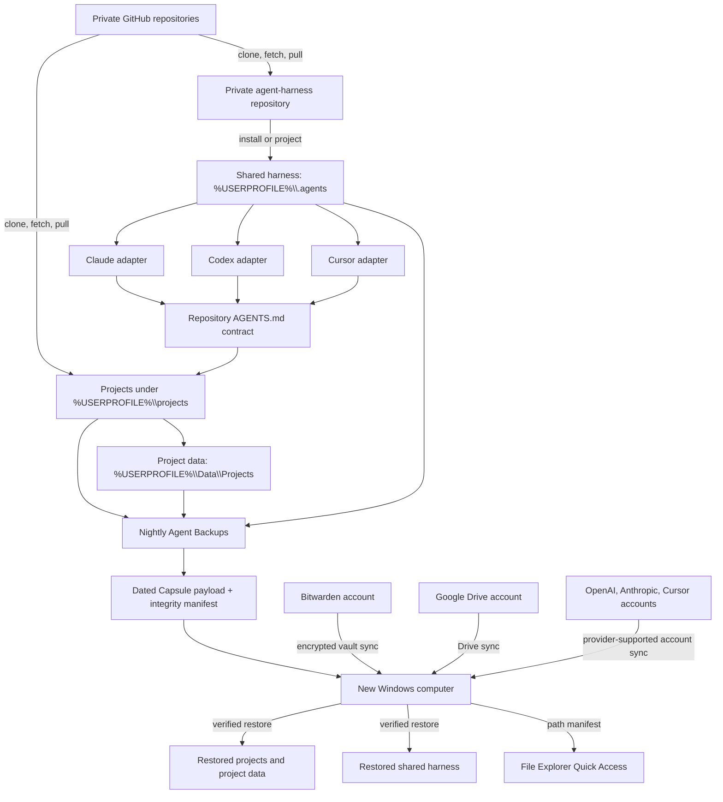

# Capsule portable computer recovery

Last consolidated: 2026-07-29

## Purpose

`C:\Users\dougl\My Drive\Capsule` is the primary synchronized copy of Douglas's transferable Windows rebuild package. A dated source or staging copy may also exist under `Documents`, but the direct My Drive folder is the receiving-computer entry point. Copying the complete Capsule to another computer provides:

- every captured project through an offline Git bundle;
- reviewed uncommitted patches and approved untracked files;
- portable project application data;
- the shared Claude, Codex, and Cursor harness;
- selected value-safe application configuration;
- File Explorer Quick Access mappings;
- safe account identifiers and an application-install manifest;
- detailed Bitwarden Password Manager setup;
- SHA-256 integrity verification.

Credentials, product sessions, browser profiles, recovery codes, restricted data, and secret values remain excluded.

## Complete connection map

Capsule now contains an explicit `AGENT-START.md` entry point. It directs an agent through integrity verification, the human setup guide, this architecture, ongoing data synchronization, Bitwarden responsibilities, and the receiving repository contract.

The preferred cross-computer source is `Google Drive\My Drive\Capsule`. The verified source-computer path is `C:\Users\dougl\My Drive\Capsule`, which lets Douglas point an agent directly at `C:\Users\dougl\My Drive\Capsule\AGENT-START.md`. A receiving computer may mirror `%USERPROFILE%\My Drive` or expose My Drive through a mounted-drive shortcut. The older Google Drive Computers route remains a fallback while the My Drive copy is still synchronizing.

The registered My Drive folder opens directly at <https://drive.google.com/drive/folders/197x4O5pCj5cuXETXuv72zeCdvkVSDJSj>.

## Build flow

1. `Nightly Agent Backups` creates a timestamped workspace snapshot.
2. Every repository with a commit receives an offline Git bundle after a Gitleaks history scan and successful clone into an empty temporary repository. A partial object store or older-history finding triggers a clean current-tree bundle; any still-flagged files are omitted and counted.
3. `Refresh-Capsule.ps1` selects a verified snapshot and copies it into a versioned Capsule payload.
4. The refresh adds the portable `.agents` harness, setup documents, restore tools, application list, and account-map template.
5. Gitleaks scans the assembled Capsule.
6. `integrity.json` records the byte length and SHA-256 hash of every other Capsule file.
7. Recovery and integrity readers decode JSON explicitly as UTF-8 so Windows PowerShell 5 preserves non-ASCII filenames.

## Receiving-computer flow

1. Open the direct My Drive folder: <https://drive.google.com/drive/folders/197x4O5pCj5cuXETXuv72zeCdvkVSDJSj>.
2. In a mirrored or streamed Google Drive installation, locate `My Drive\Capsule\AGENT-START.md`.
3. Copy or download the complete folder to a new local staging path outside OneDrive, such as `C:\Users\<user>\Capsule`.
4. Run `tools\Verify-Capsule.cmd`.
5. Run `tools\Bootstrap-Capsule.cmd`.
6. Complete Google Drive, Bitwarden, GitHub, Claude, Codex, and Cursor sign-in with the identifiers in `manifests\accounts.json`.
7. Unlock Bitwarden and verify the full-tuple Password Manager broker.
8. Open `projects\general-ai\general-ai.code-workspace`.
9. Run `Test-HarnessSetup.cmd`, `Test-AgentProjectState.cmd`, and the project verifier.

Bundle-restored repositories keep the offline bundle as the `capsule` remote and receive their recorded GitHub URL as `origin`. After `gh auth login`, `git fetch origin` retrieves published history and any Gitleaks-omitted tracked files.

The Google Drive **Computers** view remains a fallback for an older `Documents\Capsule` generation. Use it only when the direct My Drive folder is unavailable and verify the downloaded generation before bootstrap.

The bootstrap refuses existing project and shared-harness targets. Run it in a clean receiving profile or perform a reviewed additive migration.

If OneDrive is installed on the receiving computer, leave it installed and unchanged during Capsule restore. Download Capsule to a new local staging folder outside OneDrive, such as `C:\Users\<user>\Capsule`. Inventory OneDrive's selected folders, Windows known-folder mappings, unique files, collisions, and Quick Access targets before a separate migration proposal. Uninstalling, disconnecting, moving, deleting, or reconfiguring OneDrive requires additive-copy and comparison evidence.

## Recovery authority

| Layer | Authority |
|---|---|
| Human and local-development credentials | Bitwarden Password Manager Free |
| Published repository history | GitHub after account login |
| Offline repository recovery | Capsule Git bundles |
| Uncommitted work | Agent Backups patches and approved files |
| Shared agent behavior | Capsule portable `.agents` payload |
| Mutable project data | Capsule approved `Data\Projects` payload |
| Ordinary cloud documents | Google Drive account |
| Receiving-machine validation | Capsule and harness verifiers |

## Ongoing cross-computer updates

| Data class | Ongoing authority | Receiving-computer action |
|---|---|---|
| Committed project history | Project GitHub remote | Fetch and integrate |
| Shared harness | Private `agent-harness` GitHub repository | Pull, project, and verify |
| Uncommitted project work | Agent Backups | Restore a later snapshot or refreshed Capsule |
| Mutable project data | Approved `Data\Projects` backup | Restore a later snapshot or refreshed Capsule |
| Google Drive documents | Google Drive | Sign in and wait for synchronization |
| Secrets | Bitwarden or deployment provider | Sign in, sync, unlock, and use the approved broker |
| Product sessions and caches | Product account and fresh local state | Sign in again |
| Quick Access pins | Capsule path manifest | Run the Quick Access repair after projects exist |

Excluded files have no implicit synchronization route. Every excluded class must come from GitHub, Drive, Bitwarden, a provider-owned secret store, a declared project-data backup, or a separately approved restricted-data recovery plan.

## Snapshot retention

A snapshot retention policy states which dated recovery points remain and when older points are eligible for removal. No automatic deletion is active. The documented recommendation keeps 14 daily, 8 weekly, and 12 month-end snapshots, plus every labeled milestone and the newest fully restored snapshot. Any deletion tool must begin with a dry run and pause when current backup or restore verification fails.

## GitHub placement

Safe Capsule source belongs in private GitHub and is carried by `general-ai` and `agent-harness`. An assembled payload can use encrypted private GitHub Release assets, with the decryption material held in Bitwarden and a separate recovery location. GitHub enforces a 100 MiB regular Git object limit; Release assets may be under 2 GiB each. A second Drive or offline copy avoids depending on GitHub account recovery for the only recovery package.

## Known boundaries

- Product login sessions must be recreated through each product.
- GitHub CLI authentication must pass `gh auth status` before publication or remote refresh.
- Google Drive content becomes available after account sign-in and first synchronization.
- Restricted data needs its project-specific recovery plan.
- Capsule generations and Agent Backups accumulate because automatic retention deletion is disabled.

Memory-pressure and stale-process review belongs to the `declog` skill described in [brief 10](10-SKILLS-AND-ADAPTERS.md). Capsule carries the portable skill through the shared harness payload.
