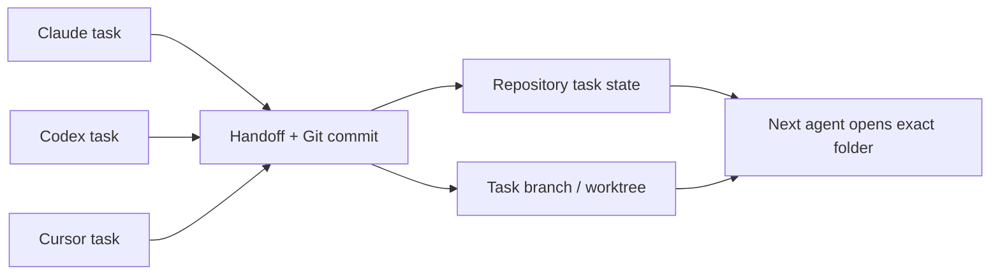

# Architecture, sessions, and cross-product communication

Last verified: 2026-07-26

## Should I start Claude from the right folder?

Yes. Start a new Claude session from the stable repository folder or the exact worktree assigned to the task. Resume an old session from the same directory it used previously.

The current directory controls:

- which `AGENTS.md` and `CLAUDE.md` apply;
- which Git repository, branch, and worktree receive changes;
- which project task state is discovered;
- which dependency files and build commands are visible;
- which local data manifest defines external storage.

A chat can contain useful context, while the files and Git state remain authoritative. When a resumed chat describes a different branch or path, stop and reconcile before editing.

## How cross-product communication works

There is no shared Claude–Codex–Cursor chat database. Communication uses durable artifacts:



The handoff records:

1. repository and absolute worktree path;
2. branch and commit identifiers;
3. named owner;
4. completed changes;
5. tests and other verification;
6. shared resources touched;
7. exact next action.

`STATUS.md` and `LOG.md` hold durable project state. `CURRENT-TASK*` and `WORK_QUEUE*` hold active session work. Git commits preserve source changes. Product chats remain supporting history.

## Project contract and project bootstrap

The project contract is the behavioral and factual content in repository-root `AGENTS.md`.

The bootstrap is the whole starter package:

- `AGENTS.md`;
- `CLAUDE.md` importing `@AGENTS.md`;
- `.gitignore` and `.env.example`;
- `data-manifest.yaml`;
- `STATUS.md`, `LOG.md`, `CURRENT-TASK.md`, `WORK_QUEUE.md`, and `BACKBURNER.md`;
- `VERIFY.md`, `MAP.md`, `DESIGN.md`, and a lean `MEMORY.md`;
- `skills-manifest.json`, `secret-manifest.json`, and generated `secret-manifest.md`;
- `.cursor\rules\00-project-contract.mdc`;
- `.gitleaks.toml` and `.github\workflows\gitleaks.yml`;
- the per-project local data directory.

Run:

```powershell
C:\Users\dougl\.agents\tools\Initialize-AgentProject.cmd -Repository C:\Users\dougl\projects\<project> -ProjectName <project>
```

The bootstrap refuses to overwrite existing files. It creates a self-contained portable `AGENTS.md` for cloud sessions and installs thin Claude and Cursor adapters. Replace its placeholders, classify the manifests, and review `git status` before committing.

## Worktrees with several agents

Each writable task gets one branch, one worktree, and one owner. Parallel agents receive different worktrees, ports, test databases, and mutable external resources.

Start:

1. open the stable repository;
2. run `git worktree list --porcelain`;
3. use the product-managed worktree when available;
4. use `agent-worktree.cmd` for a manual fallback;
5. record ownership and resource isolation in task state;
6. run the baseline verifier before editing.

Finish:

1. run required tests and adversarial checks;
2. make the worktree clean;
3. commit coherent changes;
4. write the handoff;
5. review and merge from the stable checkout;
6. remove the worktree after its work is merged or safely preserved.

Worktrees isolate tracked files. They share credentials, network services, cloud deployments, browser profiles, and external data unless the task creates an explicit boundary.

## Imported Claude sessions

Imported or resumed Claude material remains Claude-owned session history. It can help reconstruct intent. It does not automatically alter a repository. Changes occur only when an agent writes files, runs commands, invokes an external service, or performs another authorized action.

For cross-product continuation, open the matching worktree, read durable state, inspect Git, then use the imported session as additional context.
