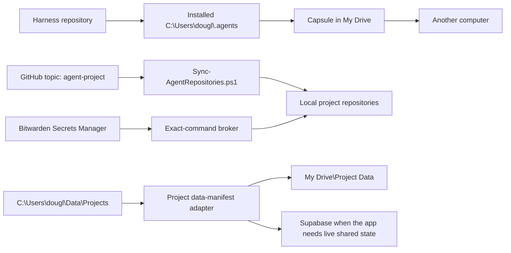

# Agent Harness Map

This repository is the source for the portable cross-agent harness. The single human-facing architecture guide is `.agents\human-readable\README.md`; `.agents\human-readable\README.html` is its browser and Obsidian mirror. `SPEC.md` is the technology-neutral functional and acceptance contract linked from that guide.

## Core documents

| Path | Purpose |
|---|---|
| `AGENTS.md` | Portable project contract for Claude, Codex, Cursor, and cloud agents |
| `SPEC.md` | Functional requirements, acceptance criteria, and recon traceability |
| `MAP.md` | Architecture, paths, data flow, integrations, and ownership |
| `DESIGN.md` | Universal interface rules plus this project's additions |
| `TASK.md` | Active queue, blockers, evidence, and next verifier |
| `STATUS.md` | Durable capability state and known limits |
| `LOG.md` | Append-only completed-work record |
| `BACKBURNER.md` | Parked work |
| `MEMORY.md` | Lean links to durable references |
| `data-manifest.yaml` | External project-data declarations |

## Architecture

### Authorities

| Concern | Authority |
|---|---|
| Shared harness source | This Git repository |
| Installed shared harness | `C:\Users\dougl\.agents` |
| Human architecture | `.agents\human-readable\README.md` |
| Functional and acceptance contract | `SPEC.md` |
| Portable global recovery | `C:\Users\dougl\My Drive\Capsule` |
| Project source and committed data | Each GitHub repository |
| Dynamic project inventory | GitHub topic `agent-project` |
| Local external project data | `C:\Users\dougl\Data\Projects\<project>` |
| Portable project-data artifacts | `C:\Users\dougl\My Drive\Project Data\<project>` |
| Modest low-churn repository binaries | Git LFS |
| Large versioned datasets and artifacts | DVC metadata in Git plus Google Drive content |
| Live shared relational state | A project's Supabase backend |
| Live JSON document state | A reviewed Vercel Blob project adapter |
| Runtime secrets | Bitwarden Secrets Manager project `Agent Runtime` |

### Main components

| Path | Purpose |
|---|---|
| `.agents\tools\Manage-Harness.ps1` | Install, project, and verify the shared harness |
| `.agents\tools\Sync-AgentRepositories.ps1` | Discover `agent-project` repositories and safely clone or pull them |
| `.agents\tools\Sync-DvcProjectData.ps1` | Publish and retrieve Git-linked large artifacts through the Drive project-data root |
| `.agents\tools\Sync-SqliteProjectData.ps1` | Create and restore verified SQLite snapshot artifacts |
| `.agents\tools\Test-ExecutableDiscovery.ps1` | Normalize user PATH and verify commands in a fresh process |
| `.agents\tools\Invoke-WithBitwardenSecret.ps1` | Inject one allowlisted BWS secret into one approved child process |
| `.agents\tools\Set-BwsMachineToken.ps1` | Store a BWS machine token in Windows Credential Manager |
| `.agents\tools\bws-command-allowlist.json` | Value-free exact-command broker policy |
| `.agents\capsule` | Global harness Capsule source, bootstrap, refresh, Obsidian config, and verification |
| `.agents\capsule\Capture-ApprovedObsidianConfig.ps1` | Deliberately capture the safe Obsidian allowlist into a tracked digest snapshot before commit |
| `.agents\capsule\Capture-ApprovedObsidianConfig.ps1` | Deliberately capture the safe Obsidian allowlist into a tracked digest snapshot before commit |
| `.agents\task-hooks` | Task-state and continuation dispatchers |
| `.agents\skills` | Shared portable skills |
| `.agents\human-readable` | Canonical human guide, HTML mirror, and changelog |

## Data flow

- GitHub carries source, project contracts, migrations, safe fixtures, and handoffs.
- Capsule carries the global harness and the approved Obsidian snapshot committed with its recorded harness revision.
- Per-project `data-manifest.yaml` files declare every external-data adapter.
- Each manifest records asset identity, local path, source, sensitivity, version, checksum, and regeneration; its thin adapter routes the asset to DVC, object storage, Drive, Supabase, or regeneration.
- Git LFS carries modest low-churn binaries. DVC metadata in Git selects large data versions whose content-addressed bytes live under `%PROJECT_DATA_SYNC_ROOT%\<project>\dvc\<asset-id>`.
- Writable SQLite databases remain local; atomic checksummed snapshots travel through Drive.
- Supabase carries concurrent, authenticated, queryable app state. Git carries its migrations and safe seed data. Off-site logical dumps cover portable recovery.
- Vercel Blob can carry private live JSON documents with conditional writes; relational storage on Vercel uses a Marketplace provider.
- Plain Google Drive folders carry human media and immutable exports.
- Cache, dependency folders, and generated build output are recreated from source.

## Integrations

| Integration | Role |
|---|---|
| GitHub | Project source, safe files, history, and topic-based inventory |
| Google Drive | Capsule distribution and reviewed external-data artifacts |
| Bitwarden Secrets Manager | Runtime secret authority for the exact-command broker |
| Supabase | Optional live relational project state |
| Vercel Blob | Optional live object/document project state |
| Git LFS | Modest, low-churn repository binaries |
| DVC | Git-linked versions of large data stored outside Git |

## Ownership and concurrency

- Each repository owns its project contract, task state, source, safe configuration, and `data-manifest.yaml`.
- The shared harness repository owns cross-agent behavior, project templates, installers, skills, adapters, and the Capsule builder.
- One writable task uses one branch, one worktree, and one file owner.
- External-data adapters must reject stale publications through conditional writes, immutable generations, or a single-writer lease.
- DVC publication checks the current `.dvc` metadata checksum and refreshes the tracked Git remote before mutation. Content objects are immutable and additive; failed publication never recursively deletes the mounted remote because another computer may have synchronized bytes into its independent Drive replica. A `%TEMP%` claim reduces same-host first-publisher collisions only. The guarded Git push is the final cross-computer update gate for the committed pointer. Retrieval refuses a destination whose bytes differ from the selected Git-linked version.
- Snapshot-style recovery exports keep 3 daily, 4 weekly, and 3 monthly verified points by default. Projects may override these counts. DVC objects referenced by retained Git branches or tags remain outside this time-bucket policy.
- A dirty or divergent repository is reported for review and remains untouched by automatic pull logic.

## Receiving-computer sequence

1. Verify and install the Capsule from a local staging copy.
2. Restore the approved Obsidian configuration.
3. Set `PROJECT_DATA_ROOT` and `PROJECT_DATA_SYNC_ROOT`.
4. Verify executable discovery in a fresh process.
5. Authenticate through existing normal-user credential stores.
6. Discover and clone GitHub repositories with the `agent-project` topic.
7. Verify each repository.
8. Run reviewed project-data adapters.
9. Bootstrap the computer's Bitwarden machine account.

OneDrive is absent from the active provider map. Migration checks retire stale OneDrive environment paths.
